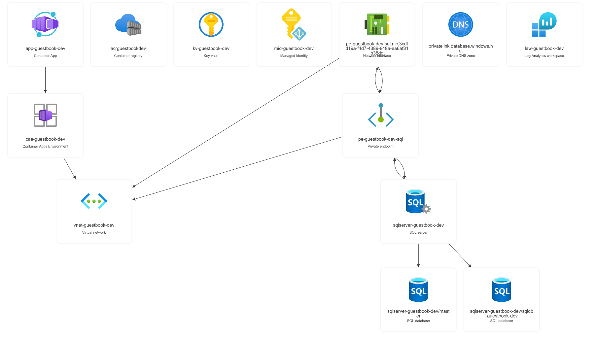
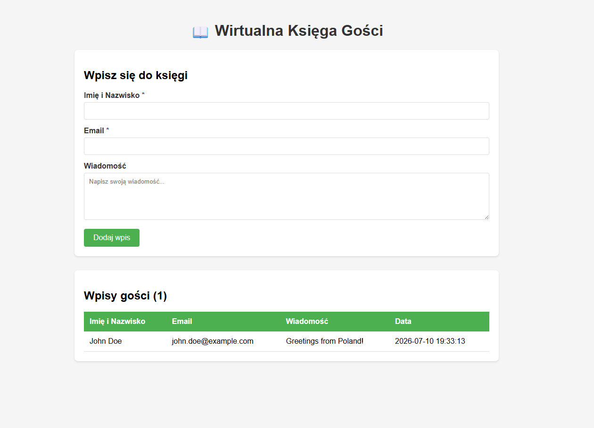
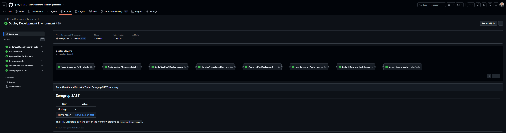
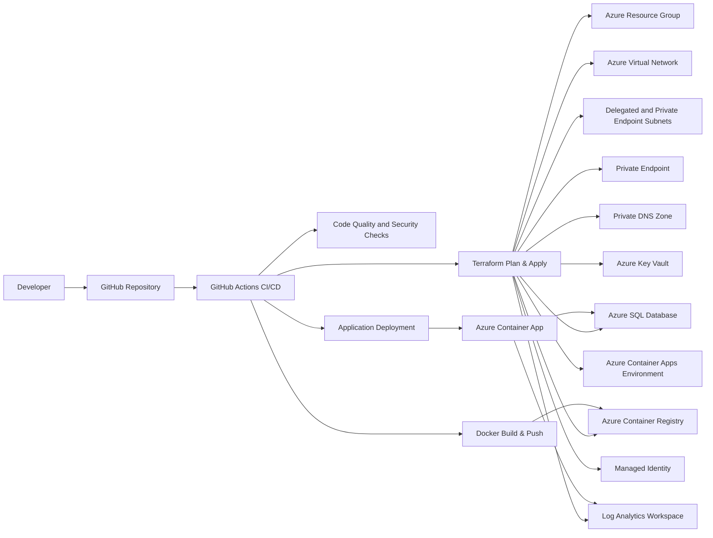

# Azure Terraform Docker Guestbook

[](https://github.com/patrykj369/azure-terraform-docker-guestbook/actions/workflows/deploy-dev.yml)


## Overview

**Azure Terraform Docker Guestbook** is a cloud-native DevOps portfolio project that demonstrates how to design, provision, secure, containerize and deploy a simple .NET Guestbook application to Microsoft Azure.

The main purpose of this repository is not only the application itself, but the complete DevOps delivery process around it:

- Infrastructure as Code with Terraform
- Containerized application delivery with Docker
- Automated CI/CD pipelines with GitHub Actions
- Azure deployment using OpenID Connect authentication
- Security checks integrated into the pipeline
- Azure Container Apps-based application hosting
- Azure SQL Database integration
- Private networking foundation with Private Endpoint and Private DNS Zone

This project was created as a practical end-to-end example of modern DevOps practices for cloud application delivery.

---

## Application

The application is a simple **Guestbook** built with **ASP.NET Core / .NET 10** and **Entity Framework Core**.

Main features:

- Add guestbook entries
- Store name, email address and message
- Display existing guestbook entries
- Persist data in SQL Server / Azure SQL
- Apply database migrations automatically
- Basic input validation
- HTML encoding for displayed user input

Although the application is intentionally simple, it is used as a realistic workload for demonstrating cloud infrastructure, containerization, CI/CD and DevSecOps practices.

---

## Screenshots

### Azure Architecture Overview

> Place a screenshot from the Azure Portal or an architecture diagram showing the deployed Azure resources.



Recommended screenshot content:

- Resource Group
- Azure Container Apps Environment
- Azure Container App
- Azure Container Registry
- Azure SQL Database
- Virtual Network
- Private Endpoint
- Private DNS Zone
- Key Vault
- Log Analytics Workspace
- Managed Identity

---

### Running Application

> Place a screenshot of the running Guestbook application after deployment.



Recommended screenshot content:

- Guestbook form
- Existing guest entries
- Public application URL from Azure Container Apps

---

### Terraform Infrastructure as Code

> Place a screenshot from VS Code, Terraform graph, or repository structure showing the Infrastructure as Code layout.


Recommended screenshot content:

- `infra/environments/dev/main.tf`
- Terraform modules
- Azure resource definitions
- Environment-specific configuration

---

### CI/CD Pipeline Run

> Optional but recommended for CV/portfolio presentation.



Recommended screenshot content:

- Code quality and security checks
- Terraform plan
- Manual approval
- Terraform apply
- Docker image build
- Azure deployment

---

## High-Level Architecture



---

## Azure Infrastructure

The Azure infrastructure is provisioned with Terraform and follows a modular structure.

Main Azure components:

| Component | Purpose |
|---|---|
| Azure Resource Group | Logical container for all environment resources |
| Azure Virtual Network | Network foundation for the environment |
| Delegated Subnet | Subnet prepared for Azure Container Apps Environment |
| Private Endpoint Subnet | Dedicated subnet for private service connectivity |
| Azure SQL Database | Persistent database for the Guestbook application |
| Azure SQL Private Endpoint | Private access path to Azure SQL |
| Private DNS Zone | DNS resolution for private Azure SQL endpoint |
| Azure Container Registry | Stores container images built by the pipeline |
| Azure Container Apps Environment | Runtime environment for containerized workloads |
| Azure Key Vault | Foundation for secret management |
| Managed Identity | Identity foundation for secure Azure resource access |
| Log Analytics Workspace | Centralized logging and monitoring foundation |

The Terraform configuration is environment-based and located under:

```text
infra/
├── environments/
│   └── dev/
│       ├── main.tf
│       ├── variables.tf
│       ├── outputs.tf
│       └── ...
└── modules/
    ├── container-app-environment/
    ├── container-registry/
    ├── key-vault/
    ├── managed-identity/
    ├── monitoring/
    ├── private-dns-zone/
    ├── private-dns-zone-virtual-network-link/
    ├── private-endpoint/
    ├── resource-group/
    ├── sql-database/
    ├── subnet/
    └── virtual-network/
```

---

## CI/CD Pipeline

The project uses **GitHub Actions** to automate validation, infrastructure provisioning, container image build and application deployment.

Main workflow:

```text
workflow_dispatch
    │
    ▼
Code Quality and Security Tests
    │
    ▼
Terraform Plan
    │
    ▼
Manual Approval
    │
    ▼
Terraform Apply
    │
    ▼
Build and Push Docker Image
    │
    ▼
Deploy Application to Azure Container Apps
```

### Pipeline Stages

| Stage | Description |
|---|---|
| Code Quality | Restores, builds and tests the .NET application |
| Formatting Check | Verifies code formatting using `dotnet format` |
| Dependency Check | Checks vulnerable NuGet packages |
| SAST | Runs Semgrep static application security testing |
| Dockerfile Lint | Runs Hadolint against the Dockerfile |
| Image Scan | Scans the built Docker image with Trivy |
| Terraform Plan | Validates and generates a Terraform execution plan |
| Manual Approval | Uses GitHub Environment approval before infrastructure changes |
| Terraform Apply | Applies the approved Terraform plan |
| Docker Build | Builds the application image and pushes it to Azure Container Registry |
| Application Deploy | Creates or updates the Azure Container App |

---

## DevSecOps Controls

This project includes several security-oriented controls in the delivery process:

- GitHub Actions authentication to Azure using OIDC
- GitHub Environment-based manual approval before deployment
- Terraform format, validation and plan stages
- Sensitive Terraform variables for SQL credentials
- Azure SQL public network access disabled by default
- Private Endpoint and Private DNS Zone for Azure SQL
- Semgrep SAST scan
- Semgrep HTML, JSON, TXT and SARIF reports
- SARIF upload to GitHub Code Scanning
- Vulnerable NuGet package check
- Hadolint Dockerfile linting
- Trivy container image vulnerability scanning
- Container App secrets for runtime configuration

---

## Docker

The application is containerized using a multi-stage Dockerfile.

The image build process:

1. Uses the .NET SDK image for build and publish
2. Restores dependencies
3. Publishes the application in Release mode
4. Uses the ASP.NET runtime image for the final container
5. Runs the application as a non-root user
6. Exposes the application on port `8080` for Azure Container Apps

Local development is also supported with Docker Compose, which starts:

- Guestbook application container
- SQL Server container
- Dedicated Docker network
- Persistent SQL Server volume

---

## Local Development

### Prerequisites

- .NET 10 SDK
- Docker
- Docker Compose
- Git

### Run with Docker Compose

```bash
docker compose up --build
```

The application should be available locally at:

```text
http://localhost:5000
```

### Run with .NET CLI

```bash
cd src/Guestbook.Api
dotnet restore
dotnet run
```

---

## Deployment Requirements

To deploy the project to Azure through GitHub Actions, configure the required GitHub secrets and environment variables.

### Required GitHub Secrets

```text
AZURE_CLIENT_ID
AZURE_TENANT_ID
AZURE_SUBSCRIPTION_ID
AZURE_REGISTRY_LOGIN_SERVER
SQL_ADMIN_PASSWORD
```

### Recommended GitHub Environments

```text
dev
dev-approval
```

The `dev-approval` environment is used as a manual approval gate before applying infrastructure changes and deploying the application.

---

## Repository Structure

```text
.
├── .github/
│   └── workflows/
│       ├── app-build.yml
│       ├── app-deploy.yml
│       ├── code-tests.yml
│       ├── deploy-dev.yml
│       ├── infra-apply.yml
│       └── infra-plan.yml
│
├── infra/
│   ├── environments/
│   │   └── dev/
│   │       ├── main.tf
│   │       ├── variables.tf
│   │       └── outputs.tf
│   │
│   └── modules/
│       ├── container-app-environment/
│       ├── container-registry/
│       ├── key-vault/
│       ├── managed-identity/
│       ├── monitoring/
│       ├── private-dns-zone/
│       ├── private-endpoint/
│       ├── resource-group/
│       ├── sql-database/
│       ├── subnet/
│       └── virtual-network/
│
├── src/
│   └── Guestbook.Api/
│       ├── Data/
│       ├── Migrations/
│       ├── Models/
│       ├── Program.cs
│       ├── appsettings.json
│       └── GuestBook.csproj
│
├── Dockerfile
├── docker-compose.yml
├── global.json
└── README.md
```

---

## Key DevOps Skills Demonstrated

This project demonstrates practical experience with:

- Azure cloud architecture
- Infrastructure as Code
- Terraform module design
- Azure networking
- Private Endpoint configuration
- Azure SQL deployment
- Containerized application delivery
- Docker image build optimization
- GitHub Actions reusable workflows
- CI/CD pipeline orchestration
- Manual approval gates
- OIDC-based cloud authentication
- DevSecOps pipeline integration
- SAST and container vulnerability scanning
- Secure configuration handling
- Application deployment to Azure Container Apps
- Cloud monitoring foundation with Log Analytics

---

## Project Purpose

This repository was created as a hands-on DevOps engineering project and portfolio showcase.

It presents a complete delivery path from source code to cloud deployment, including infrastructure provisioning, security validation, container image management and automated deployment to Azure.

The project is suitable for demonstrating practical DevOps, Cloud and Infrastructure as Code skills in a professional CV or technical portfolio.

---

## Future Improvements

Possible next steps:

- Add Azure Front Door with WAF
- Add custom domain and TLS certificate
- Replace SQL password authentication with managed identity authentication
- Store application secrets fully in Azure Key Vault
- Add application health checks
- Add integration tests
- Add Terraform documentation generation
- Add architecture diagram generated from IaC
- Add monitoring dashboards and alerts
- Add production environment with separate approval flow

---

## Author

Created by **Patryk Jabłoński**.

